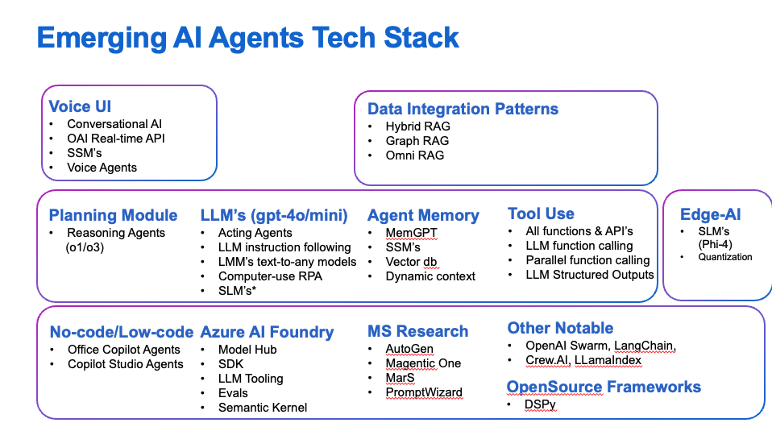

# 🤖 Introduction to AI Automation with AutoGen  

We now know autogen is a multi-agent framework from **Microsoft Research**for building automated AI workflows.
...but why do we need these "frameworks" in the first place?

AI automation for non-deterministic and dynamic tasks requires creating a "workflow" that can be executed with code, external API calls and data access on the go. Two points are crucial here...

Let's work backwards from the needs for complex AI Automation and see how AutoGen can help us...

## AI Automation Requirements - Agent Stack design requirements 

1. **Task decomposition & planning** We need to diminish the task into smaller sub-tasks that can be executed in parallel (where we can to untangle dependencies and turn calls into "asynchrounous calls"). This is where we need "reasoning llm's" for their "executive function" capabilities much like in humans. \
    -**Reasoning LLM's for task decomposition & planning** with  best in class instruction following \
    -**Multi-agent communication support**  asynchronous and event-driven multi-agent communication between worker llm instances (agents) is key for teams of AI agents interacting for concurrent problem-solving agents. This  will require agents engaging in dialogue, ask each other for clarification, and iteratively refine outputs e.g. by launching nested chats – rather than just passing data along a fixed chain​. To facilitate we need an agent communications "language" or a "protocol" that enables agents to send messages to each other, ask questions, provide answers, or invoke tools in a back-and-forth dialogue​ and provide message routing and can enforce conversation patterns (e.g. turn-taking). 
    
2. **Tool use** via "function calling" we need to be able to run code, call APIs & db's  on the fly consistently and correctly. \
    -**Structured Outputs** LLM structured outputs support is key for consistent & correct function calls \
    -**Consistent Calls** LLM function calling performance should be consistent and correct \
    -**Instruction Following** Instruction following determines prompt performance e.g. how well you can your intent into LLM actions with Prompt Engineering. It is the prompt engineering elasticit... \
    -**Capable & optimal Worker LLM's** We need optimal worker LLM's performance, latency & cost that will act in "specialised roles".

3. **Episodic Memory** For complex tasks we need to store state, fix problems on the go, backtrack where necessary and adopt a different plan if the execution is failing... 
    - **Memory Management** Long term memory modules required for long running tasks 
    - **Context Management & sharing** Agents may need to share context 

4. **Code Generation & Execution** This is useful for tasks like debugging, data analysis, or tool use in situ. Cross language support (inherent capability of today's llm's) is required for this too.

4. **Observability** is key for "interpretable" AI Automation implementations for debugging / troubleshooting and for instilling trust in users. Observability today mostly means OpenTelemety support.

5. **Support for Human in the Loop** flows for human oversight for critical tasks...

6. **Agent Evals**  Evals is mandatory for any serious AI Automation project ensure consistent and high performance of the system as a whole...

--
## AutoGen - The "Why"? 
[Burayi AutoGen'i tanidikca dolduracagiz!!!]

👉 [You can now proceed with basic auto-gen capabilities](./part1_autogen_basics.md)
👉 [...or jump straight into AutoGen's advanced capabilities](./part1_autogen_advanced.md)